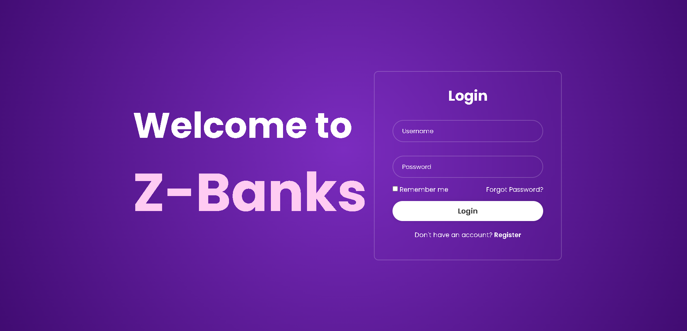
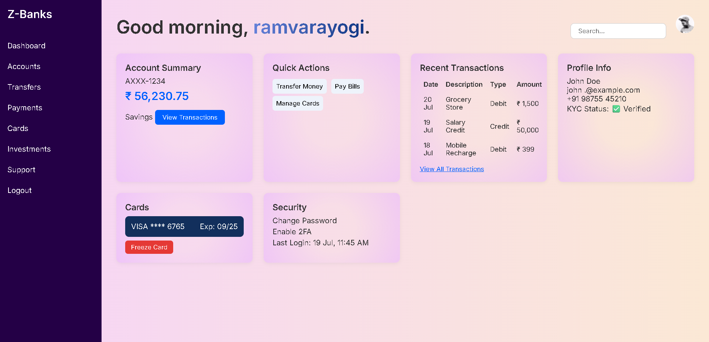

# z_banks_unstophck
# 💳 Z-Banks

Selected statement: 
  Problem statement 1:- 
  Break the Bank  : Make a dashboard profile page, homepage design for banking website 

Z-Banks is a modern and responsive **banking dashboard web app** built using only HTML, CSS, and vanilla JavaScript. It provides a user-friendly interface for managing bank accounts, viewing recent transactions, and simulating secure login/signup operations.



---

## 🚀 Features

- 🔐 Login and Sign-up with localStorage-based credential management
- 📊 Dashboard overview with:
  - Account summary
  - Quick actions (Transfer, Pay Bills, Manage Cards)
  - Recent transactions
  - Profile and security information
- 🎨 Clean and responsive design using CSS
- 📱 Fade-in animations for smooth UI experience
- 🧠 JavaScript-powered logic (no backend)

---

## 📂 Project Structure

```plaintext
├── index.html         # Dashboard page after login
├── login.html         # Login page
├── signup.html        # Sign-up/registration page
├── style.css          # Common styles
├── login.css          # Login and sign-up styles
├── logo2.png          # Favicon/logo (used in header)
└── README.md          # Project documentation
````

🧩 Technologies Used
- HTML5
- CSS3
- JavaScript (ES6)
- Google Fonts (Inter)
- Browser localStorage

📌 Notes
This project is purely front-end based — no real authentication or database is used.
Ideal for educational/demo purposes and UI prototyping.
